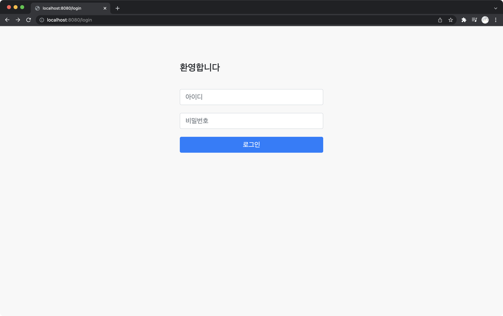

# Go와 Docker를 이용한 웹 서비스 만들기

## 1. 개요

이 저장소는 `https://tear94fall.tistory.com` 블로그의 포스팅되는 `Go와 Docker를 이용한 웹 서비스 만들기`의 예제코드 입니다.  
블로그에는 코드에 대한 설명과 프로젝트 진행 과정에 대해 다룰 예정입니다.  

## 2. 목차

|순서|내용|설명|상태|
|:--:|:---|:---|:---:|
|1|프로젝트 개요 및 개발 환경 구축|프로젝트 개요를 설명하고 개발 환경을 구축한다|완료|
|2|api 서버 만들기|gin을 이용해 간단한 api 서버를 만들고 테스트를 진행한다|완료|
|3|기본 화면 띄위기|웹 서비스의 기본적인 화면을 띄운다|예정|
|4|데이터 베이스 연동하기|데이터 베이스를 연동하고 테스트를 진행한다|예정|
|5|프로젝트 구조 설계|만드려고하는 웹서비스의 전체적인 구조를 설계한다|예정|
|6|로그인 기능 만들기|웹서비스의 가장 기초가 되는 로그인 기능을 만든다|예정|
|8|회원가입 기능 추가|회원가입이 가능하도록 페이지 및 기능을 만든다|예정|
|7|게시물 쓰기|게시판의 기초가되는 게시물을 작성하는 기능을 만든다|예정|
|8|게시물 삭제, 수정|게시물의 삭제와 수정 기능을 추가한다|예정|
|9|게시물 리스팅 하기|게시물의 리스트 기능을 만든다|예정|
|10|게시물 리스트 페이징 처리|게시물을 전체 가져오지 않고 페이지 처리 기능을 추가한다|예정|
|11|게시물 검색 기능 추가|게시물의 검색 기능을 추가한다|예정|
|12|게시물의 댓글 기능을 추가|게시물의 댓글을 추가할수 있도록 한다|예정|
|13|게시물의 파일첨부 기능 추가|게시물에 파일을 첨부할 수 있도록 한다|예정|
|14|관리자 기능 추가|관리자 계정 생성 및 일반 계정과 역할을 분리 한다|예정|
|15|배포하기|도커를 이용해 프로젝트를 빌드 및 배포한다|예정|
|+|테스트 환경 구축 및 테스트|테스트 코드 작성 및 유닛 테스트, POSTMAN을 이용한 테스트|추가 예정|
|+|젠킨스를 이용한 무중단 배포|추가 예정|

## 3. 기타

* chap 1번과 2번은 블로그 `https://tear94fall.tistory.com` 에서 아래의 포스팅으로 확인 가능합니다. 
    * `Go 설치하고 개발 환경 구축하기`  
    * `Docker를 사용하여 Mysql 컨테이너 생성하고 접속하기`  
* 프로젝트를 진행하며 필요하다고 생각되는 부분은 챕터가 추가되거나 순서가 변경 될수도 있습니다.

## 3. 프로젝트 구동 이미지

### 3.1. 로그인 화면 구현하기

